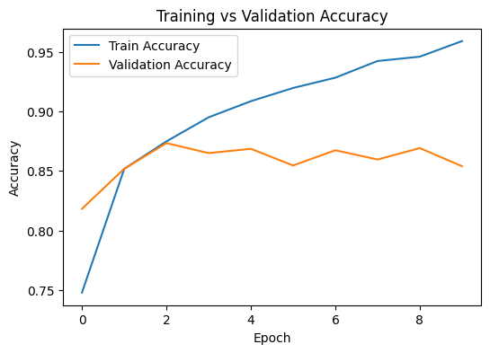

# Sentiment Analysis using LSTM

## 🎯 Objective
Build a deep learning model to classify IMDb movie reviews as **Positive** or **Negative** based on their textual content using a Long Short-Term Memory (LSTM) network.

---

## 🧠 Dataset
- **Dataset:** IMDb Large Movie Review Dataset (50,000 labeled reviews)
- **Source:** [IMDb Dataset on Kaggle](https://www.kaggle.com/datasets/lakshmi25npathi/imdb-dataset-of-50k-movie-reviews)

---

## 🧩 Methodology
1. **Text Preprocessing**
   - Tokenization, padding, and cleaning the text  
   - Removing stopwords and converting to lowercase  
2. **Model Architecture**
   - Embedding Layer → LSTM Layer → Dense (Sigmoid)  
   - **Loss:** Binary Cross-Entropy  
   - **Optimizer:** Adam  
   - **Activation:** Sigmoid for binary classification  
3. **Training Details**
   - Epochs: 10  
   - Batch Size: 64  
   - Validation Split: 20%

---

## 📊 Results
| Metric | Value |
|:--|:--:|
| **Training Accuracy** | 96.07% |
| **Validation Accuracy** | 85.34% |
| **Test Accuracy** | 85.50% |
| **Test Loss** | 0.4515 |

**Example Prediction**  
> *Input:* “The movie was absolutely fantastic!”  
> *Model Output:* Positive (0.95 confidence)

---

## 📈 Visualization
**Training vs Validation Accuracy**  
A line plot was generated to visualize accuracy trends across epochs for both training and validation data.  
This helps assess model learning stability and potential overfitting.

*(If you upload the plot image, reference it like this below)*  
```markdown

---

## 🧑‍💻 Author
**Navdeep Khandelwal**  
📜 Certified in Artificial Intelligence, Machine Learning & Deep Learning from **IIT Delhi (2025)**  
📍 Rajasthan, India  
🔗 [GitHub Profile](https://github.com/navdeepkhandelwal)


